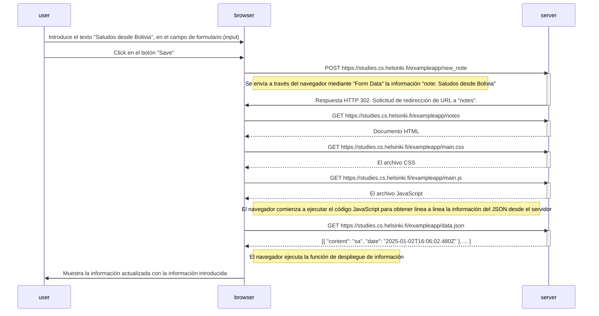

```mermaid
sequenceDiagram
    participant user
    participant browser
    participant server

    user->>browser: Introduce el texto "Saludos desde Bolivia", en el campo de formulario (input)
    user->>browser: Click en el botón "Save"

    browser->>server: POST https://studies.cs.helsinki.fi/exampleapp/new_note
    activate server

    Note right of browser: Se envía a través del navegador mediante "Form Data" la información "note: Saludos desde Bolivia"

    server->>browser: Respuesta HTTP 302. Solicitud de redirección de URL a "notes".
    deactivate server

    browser->>server: GET https://studies.cs.helsinki.fi/exampleapp/notes
    activate server
    server-->>browser: Documento HTML
    deactivate server

    browser->>server: GET https://studies.cs.helsinki.fi/exampleapp/main.css
    activate server
    server-->>browser: El archivo CSS
    deactivate server

    browser->>server: GET https://studies.cs.helsinki.fi/exampleapp/main.js
    activate server
    server-->>browser: El archivo JavaScript
    deactivate server

    Note right of browser: El navegador comienza a ejecutar el código JavaScript para obtener linea a linea la información del JSON desde el servidor

    browser->>server: GET https://studies.cs.helsinki.fi/exampleapp/data.json
    activate server
    server-->>browser: [{ "content": "sa", "date": "2025-01-02T16:06:02.480Z" }, ... ]
    deactivate server

    Note right of browser: El navegador ejecuta la función de despliegue de información

    browser->>user: Muestra la información actualizada con la información introducida
```