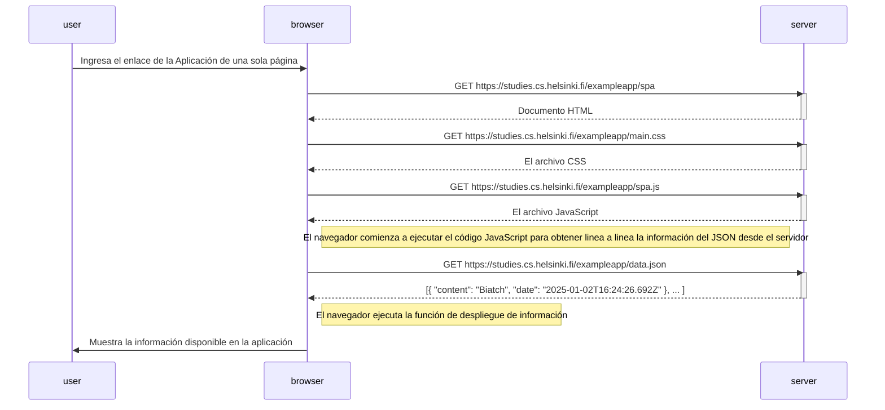

```mermaid
sequenceDiagram
    participant user
    participant browser
    participant server

    user->>browser: Ingresa el enlace de la Aplicación de una sola página

    browser->>server: GET https://studies.cs.helsinki.fi/exampleapp/spa
    activate server
    server-->>browser: Documento HTML
    deactivate server

    browser->>server: GET https://studies.cs.helsinki.fi/exampleapp/main.css
    activate server
    server-->>browser: El archivo CSS
    deactivate server

    browser->>server: GET https://studies.cs.helsinki.fi/exampleapp/spa.js
    activate server
    server-->>browser: El archivo JavaScript
    deactivate server

    Note right of browser: El navegador comienza a ejecutar el código JavaScript para obtener linea a linea la información del JSON desde el servidor

    browser->>server: GET https://studies.cs.helsinki.fi/exampleapp/data.json
    activate server
    server-->>browser: [{ "content": "Biatch", "date": "2025-01-02T16:24:26.692Z" }, ... ]
    deactivate server

    Note right of browser: El navegador ejecuta la función de despliegue de información

    browser->>user: Muestra la información disponible en la aplicación
```