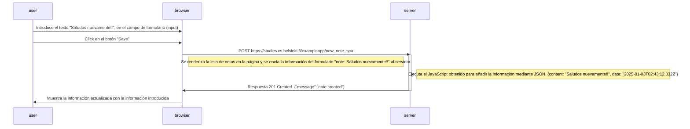

```mermaid
sequenceDiagram
    participant user
    participant browser
    participant server

    user->>browser: Introduce el texto "Saludos nuevamente!!", en el campo de formulario (input)
    user->>browser: Click en el botón "Save"

    browser->>server: POST https://studies.cs.helsinki.fi/exampleapp/new_note_spa
    activate server

    Note right of browser: Se renderiza la lista de notas en la página y se envía la información del formulario "note: Saludos nuevamente!!" al servidor.

    Note right of server: Ejecuta el JavaScript obtenido para añadir la información mediante JSON. {content: "Saludos nuevamente!!", date: "2025-01-03T02:43:12.032Z"}

    server->>browser: Respuesta 201 Created. {"message":"note created"}
    deactivate server

    browser->>user: Muestra la información actualizada con la información introducida
```